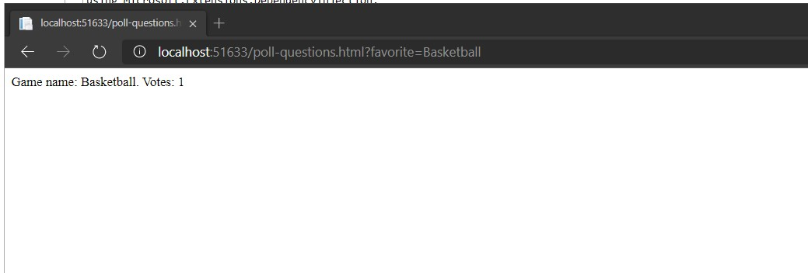

# Module 3: Configuring Middleware and Services in ASP.NET Core

## Lab: Configuring Middleware and Services in ASP.NET Core 

1. **Nombres y apellidos:** Francisco Javier Moreno Quevedo
2. **Fecha:** 06/12/2020
3. **Resumen del Ejercicio:**  Añadir los componentes necesarios para hacer funcional la aplicacion 2/4
4. **Dificultad o problemas presentados y como se resolvieron:** Ninguna


- Ejercicio 3: Using Dependency Injection

  - Añadimos la carpeta Services
  - Añadimos en esa carpeta el enum **SelectedGame**
  - Añadimos el interface  **IPollResultsService**

  

  ```cs
     public interface IPollResultsService
      {
          void AddVote(SelectedGame game);
          SortedDictionary<SelectedGame, int> GetVoteResult();
      }
  ```

  

  - Añadimos la clase **PollResultsService** que implementa el interface **IPollResultsService**

  ```C#
     public class PollResultsService : IPollResultsService
      {
          private Dictionary<SelectedGame, int> _selectionVotes;
  
          public PollResultsService()
          {
              _selectionVotes = new Dictionary<SelectedGame, int>();
          }
  
          public void AddVote(SelectedGame game)
          {
              if (_selectionVotes.ContainsKey(game))
              {
                  _selectionVotes[game]++;
              }
              else
              {
                  _selectionVotes.Add(game, 1);
              }
          }
  
          public SortedDictionary<SelectedGame, int> GetVoteResult()
          {
              return new SortedDictionary<SelectedGame, int>(_selectionVotes);
          }
  
      }
  ```

  - En el middleware configuramos el servicio **IPollResultsService**

  

  ```C#
   public void ConfigureServices(IServiceCollection services)
          {
              services.AddSingleton<IPollResultsService, PollResultsService>();
              services.AddMvc();
          }  
  ```

  - EN el metodo configure añadimos codigo para que mantenga los votos en el diccionario

  
              
  ```C#
      public void Configure(IApplicationBuilder app, IHostingEnvironment env, IPollResultsService pollResults)
          {
              
              app.Use(async (context, next) =>
               {
                   if (context.Request.Query.ContainsKey("favorite"))
                   {
                       string selectedValue = context.Request.Query["favorite"];
                       SelectedGame selectedGame = (SelectedGame)Enum.Parse(typeof(SelectedGame), selectedValue, true);
                       pollResults.AddVote(selectedGame);
                       //await context.Response.WriteAsync("Selected value is: " + selectedValue);
                       SortedDictionary<SelectedGame, int> gameVotes = pollResults.GetVoteResult();
  
                       foreach (KeyValuePair<SelectedGame, int> currentVote in gameVotes)
                       {
                           await context.Response.WriteAsync($"<div> Game name: {currentVote.Key}. Votes: {currentVote.Value} </div>");
                       }
                   }
                   else
                   {
                       await next.Invoke();
                   }
               });
  
              app.UseStaticFiles();
  
              app.Run(async (context) =>
              {
                  //await context.Response.WriteAsync("This text was generated by the app.Run middleware.");
                  await context.Response.WriteAsync("This text was generated by the app.Run middleware. wwwroot folder path: " + env.WebRootPath);
              });
          }
  ```


- Ejecutamos y seleccionamos Basketball



- seleccionamos football


- seleccionamos Basketball

